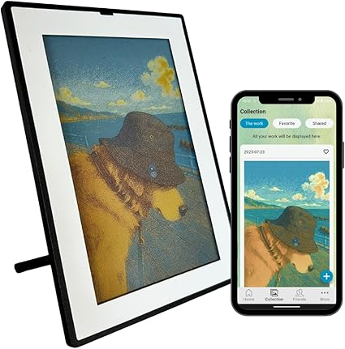

<div align="center">
    
    <div style="font-size: 20px;">art</div>
    
</div>

<div align="center">

# SMARTWIZ+ art: Local Developer API Tools
</div>

> [!WARNING]
> **Understanding EPD (Electronic Paper Display)**
> This is a 6-color E-Ink (Spectra 6) display, NOT an LED or LCD screen. EPD panels do not emit light and rely entirely on ambient lighting, looking similar to a real printed poster. They have slow refresh times (up to ~30 seconds) and will flash visibly during updates to clear previous ghosting. If you're expecting instantaneous video-like updates or bright backlights, this product is not for you. E-Ink technology is optimized for zero-power, beautiful static ambient art.
> *   **Color Profile:** Unlike LCDs that display millions of colors, this panel uses **6 physical pigments**. Colors have a unique **"painterly" or dithered texture** rather than smooth digital gradients. This is a characteristic of high-end Spectra 6 technology and gives the display its distinct "printed poster" aesthetic.

<div align="center">
    
</div>

## What is this?

Welcome to the official developer tools for the [SMARTWIZ+ art](https://www.disign-store.com/en/smartwiz-art/) digital frame ([See it on Amazon](https://www.amazon.com/dp/B0FPCSN9N2)). 

This repository provides Python scripts and API documentation to let you control your 6-color E-Ink Spectra 6 display locally. We are releasing this specifically for users who want the freedom to hack, automate, and display their own generative or server-hosted content without relying on our cloud servers or the proprietary smartphone app.

## Why Local Control?

To ensure maximum privacy and security, all communication happens entirely on your local network:
* **Initial Setup:** Via BLE (utilizing the BLUFI protocol for Wi-Fi provisioning).
* **Control & Upload:** Via local HTTP over your own Wi-Fi network.

**Separation of Concerns:** 
Please be aware that activating this local mode will immediately unregister the device from the official smartphone app (if registered prior), as the hardware is designed to maintain a single point of control. Cloud-based features such as scheduled events, and friend-to-friend image (with message) transfers are tied to the manufacturer’s infrastructure and are not supported here. Instead, this repository provides a dedicated path for pure local "free drawing" automation. This allows you to treat your art frame as a blank, offline canvas that reacts to your own local triggers and scripts, fully integrated into your own home network without any external dependencies.

---

## Official API Documentation (PDF)

The **SMARTWIZ+ art API Developer Guide** is included in the `/docs` directory of this repository. 

---

## Technical Requirements

**Required Environment:** Ubuntu / Linux (Recommended).  
*Note: While these scripts may run on Windows or macOS, they are primarily verified on Ubuntu. Users on other platforms may encounter Bluetooth security restrictions (macOS) or command-line tool conflicts (Windows).*

Before getting started, ensure your environment is equipped with:

1. **Python 3**: To run the provided automation scripts.
2. **Python Libraries**:
   - **bleak**: Required for BLE scanning and device detection.
   - **pyBlufi**: Essential for initial Wi-Fi configuration.
   - **requests**: For handling HTTP API communication.
   - **cryptography**: For RSA/AES security and payload signing.
   - **Pillow**: For basic image handling in conversion scripts.
3. **ImageMagick**: The E-Ink Spectra 6 panel requires highly specific dithering configurations. ImageMagick handles this transformation.
4. **OpenSSL**: Needed for generating RSA 2048 key pairs.

### Installation

You can install the Python dependencies using the following commands:

```bash
sudo apt update
sudo apt install imagemagick openssl

pip install bleak requests cryptography pillow
pip install git+https://github.com/someburner/pyBlufi.git
```

---

## Quick Start Guide

Follow these steps to generate keys, claim the device, and push an image locally. 
> **Documentation Reference:** For detailed API specifications, signature payloads, and packet structures, refer to `doc/SMARTWIZ+art_APIDeveloperGuide.pdf`.

### 1. Initialize Device
Hold the physical switch on the Art Frame for **>10 seconds** until the LED blinks rapidly to enter BLE pairing mode.

> [!IMPORTANT]
> **Cloud Event Cleanup:** To ensure a clean transition and clear any persistent cloud-scheduled events from the hardware, we highly recommend **deleting the device from the official SMARTWIZ+ smartphone app** *before* running the local registration script.

### 2. Device Detection (BLE)
Listen for BLE advertisements to retrieve the `local_name`.
```bash
cd examples
python3 ./scan_art_device.py
```
*(References: `examples/scan_art_device.py`, [API Guide](doc/SMARTWIZ+art_APIDeveloperGuide.pdf) Section 4.2)*

### 3. Network Connection (BLE)
Scan for Wi-Fi networks and transmit your local SSID/Password over Bluetooth. 

```bash
python3 ./get_ssid_list.py <local_name>
python3 ./connect_wifi.py <local_name> <WIFI_SSID> <WIFI_PASSWORD>
```
*(References: `examples/get_ssid_list.py` & `examples/connect_wifi.py`, [API Guide](doc/SMARTWIZ+art_APIDeveloperGuide.pdf) Section 4.3)*

### 4. Get Device Status (Obtain Device ID)
Once connected to Wi-Fi, retrieve the unique `device_id` needed for HTTP control.
```bash
python3 ./get_status.py <local_name>
```
*(References: `examples/get_status.py`, [API Guide](doc/SMARTWIZ+art_APIDeveloperGuide.pdf) Section 4.4)*

### 5. Art Frame Registration
Exchange RSA public keys using the `device_id`. This disconnects the official app (if registered).

```bash
python3 ./device_register.py <device_id>
```
*(References: `examples/device_register.py`, [API Guide](doc/SMARTWIZ+art_APIDeveloperGuide.pdf) Section 4.5)*

### 6. Converting Images for Display
Convert standard JPG/PNG files into the mandatory 6-color hardware dithered format (`.s6`).
```bash
python3 ./convert_image.py input_image.jpg output_image.s6
```
*(References: `examples/convert_image.py`, [API Guide](doc/SMARTWIZ+art_APIDeveloperGuide.pdf) Section 4.6)*

### 7. Displaying Images
Upload and render the converted `.s6` payload to the frame.
```bash
python3 ./display_local_image.py <device_id> output_image.s6
```
*(References: `examples/display_local_image.py`, [API Guide](doc/SMARTWIZ+art_APIDeveloperGuide.pdf) Section 4.7)*

---

## 🛠️ Troubleshooting & Tips

### Network: "Failed to resolve .local"
*   **Requirement:** Your PC and the Art Frame MUST be on the same Wi-Fi SSID (2.4GHz).
*   **Power & Sleep:** Always use **USB power** for developer tasks. 
    *   On battery, the device sleeps for 1 hour at a time.
    *   **To wake it manually:** Short-press the physical button. This forces a Wi-Fi connection for ~1m 40s, allowing you to send HTTP requests.

---

## Concrete Example: Auto-Folder Sync

You can build automation scripts that run via cronjobs or long-running daemons. 

For example, you could write a Python script that monitors a specific local folder on your PC or Home Server. The script would automatically:
1. Scan the folder for new `JPG/PNG` images.
2. Run the Spectra 6 ImageMagick dithering conversion automatically via `convert_image.py`.
3. Periodically cycle through the converted `.s6` images and push them to the frame utilizing `display_local_image.py`.

> [!NOTE]
> **Sample Implementation:** A working sample implementation will be uploaded to this repository in the future to help you get started.

---

## Available Local Control Scripts

The `examples/` directory contains various scripts illustrating API usage so you don't have to build the packet signatures from scratch:

| Script Name | Purpose / Description |
| :--- | :--- |
| `scan_art_device.py` | Scans local BLE broadcasts to find SMARTWIZ+ art frames in pairing mode. |
| `get_status.py` | Retrieves current Wi-Fi connection and general operational status over BLE. |
| `get_ssid_list.py` | Queries the device via BLE to retrieve nearby 2.4GHz Wi-Fi SSIDs it can see. |
| `connect_wifi.py` | Configures the device's Wi-Fi connection over pyBlufi, passing credentials securely. |
| `disconnect_wifi.py` | Commands the device to drop its current Wi-Fi connection. |
| `device_register.py` | Exchanges RSA public keys to bind the device to your developer environment and sever ties with the official smartphone app. |
| `device_unregister.py` | Releases your developer HTTP control, allowing the device to be re-paired with the official smartphone app cloud. |
| `convert_image.py` | A wrapper for ImageMagick that transforms standard images into Spectra 6 specific dithered `.s6` binary payloads. |
| `display_local_image.py` | Pushes an '.s6' file over HTTP with a signed payload to update the E-Ink display immediately. |
| `display_weather_info.py` | An example automation script demonstrating how to fetch weather data, parse it, and construct/upload an image for the frame. |
| `folder_sync.py` | (Coming soon) A reference automation script that monitors a local folder and cycles through images on the frame. |
| `epd_util.py` | Shared cryptographic and networking utility functions utilized by the other HTTP API example scripts. |

---

## Limitations & Warnings

*   **Mutual Exclusivity:** As soon as you run `device_register.py`, the official smartphone app will immediately disconnect and wipe its cloud configurations from the device. You cannot use the cloud app and local API simultaneously.
*   **Power Supply Requirement:** You **MUST** supply constant power via USB-C for reliable HTTP API control. 
*   **Battery Sleep Cycle:** On battery, the device enters deep sleep and only wakes up **once per hour** for approximately **1 minute and 40 seconds** to check for updates.
*   **Wake Command:** To force the device to connect to the network while on battery, you must **short-press the physical button**.
*   **Deep Dive:** For a more detailed technical explanation of how local vs. cloud delivery works and how battery operation affects update timing, see our official guide: [Understanding Image Sharing and Update Timing on SMARTWIZ+ art](https://www.disign-store.com/en/support-topics/understanding-image-sharing-and-update-timing-on-smartwiz-art/).
*   **Component Lifespan:** E-Ink display lifetimes deteriorate if rewritten constantly. Do not update the display at an interval shorter than 15-30 minutes.

---

## Community & Support

Have a question, a feature idea, or need help? Please use our GitHub Discussions page!

## Contact
If you are experiencing true hardware faults, please consult the [Official Disign Support Page](https://www.disign-store.com/en/support/smartwiz-productsupport/). 
